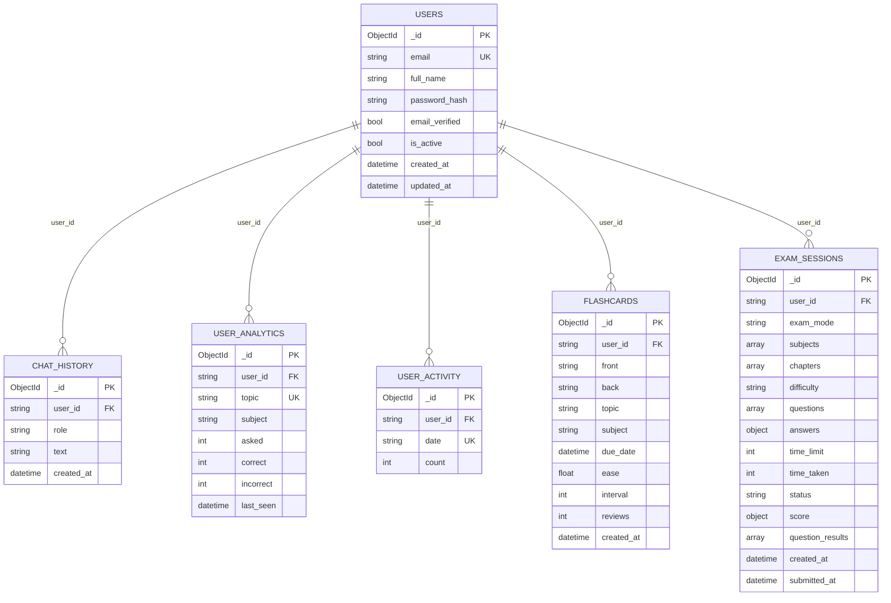
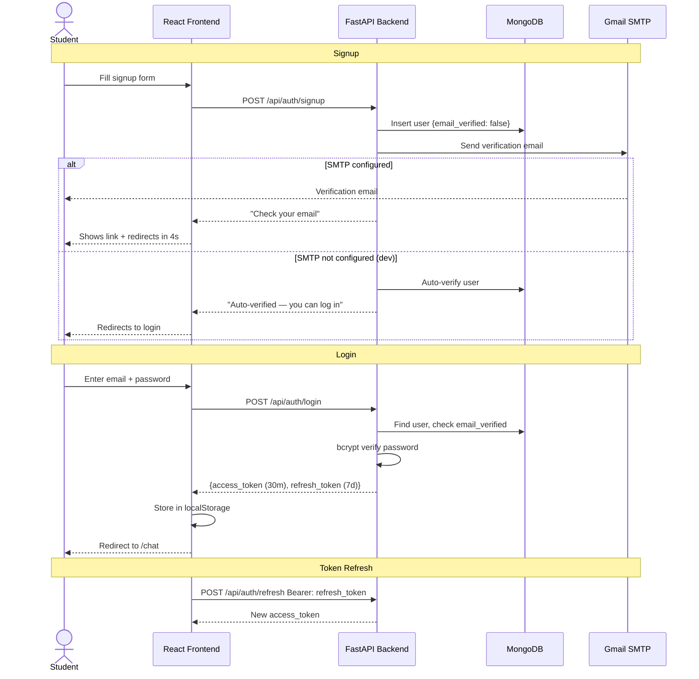
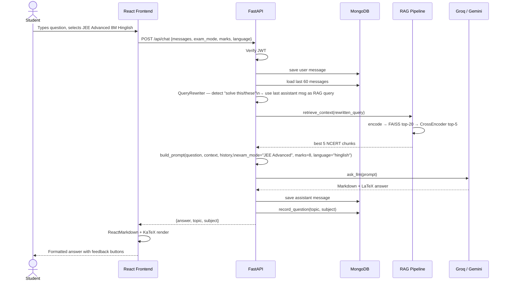
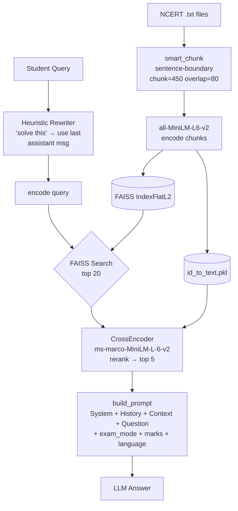
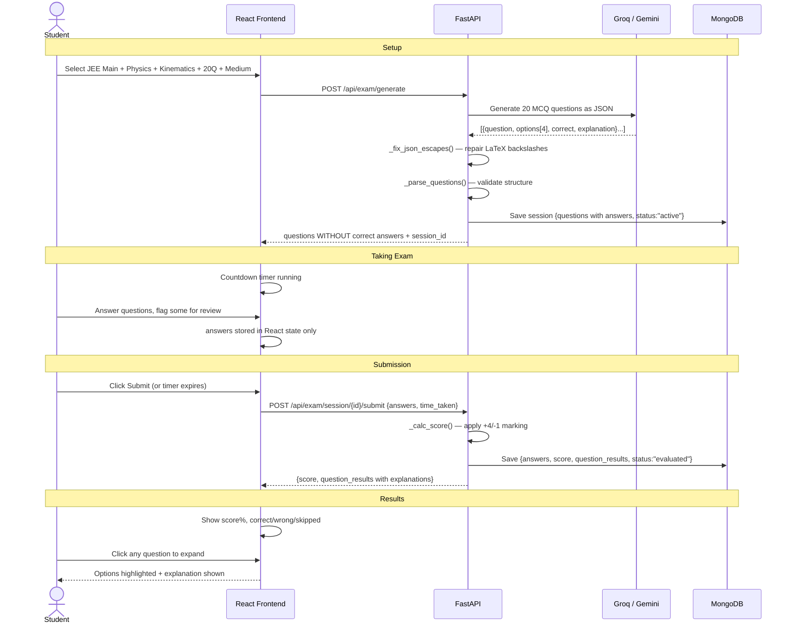
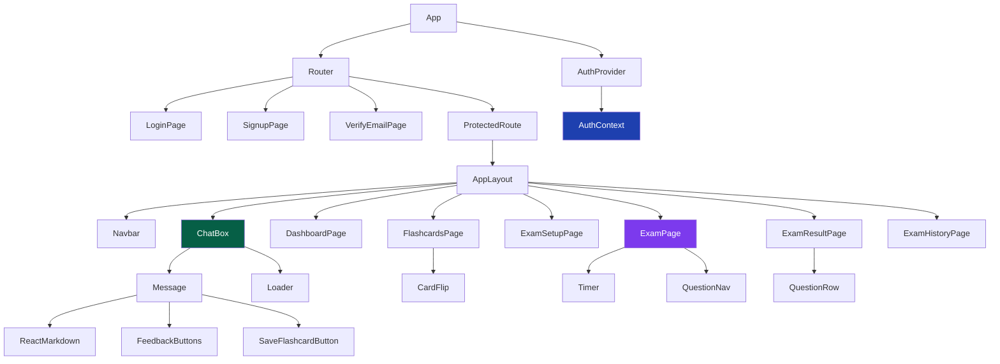

# JEE/NEET AI Platform — Full-Stack Study Assistant

> A complete AI-powered study platform for JEE & NEET students — RAG-based chat tutor, online exam engine with AI evaluation, spaced-repetition flashcards, performance analytics, and more. **100% free infrastructure.**

---

## Table of Contents

- [Overview](#overview)
- [Feature List](#feature-list)
- [Tech Stack](#tech-stack)
- [System Architecture](#system-architecture)
- [Database Schema](#database-schema)
- [Class Diagram](#class-diagram)
- [Auth Flow](#auth-flow)
- [Chat Request Flow](#chat-request-flow)
- [RAG Pipeline](#rag-pipeline)
- [Exam Platform Flow](#exam-platform-flow)
- [Frontend Component Tree](#frontend-component-tree)
- [Local Setup](#local-setup)
- [Quick Start](#quick-start)
- [Folder Structure](#folder-structure)
- [API Reference](#api-reference)
- [Free Tier Limits](#free-tier-limits)
- [Deployment](#deployment)

---

## Overview

**JEE-NEET-RAG** is a full-stack educational AI platform. Students get NCERT-grounded answers via two-stage RAG, take AI-generated online exams, review weak topics on a dashboard, and build flashcard decks with one click — all for free.

**Why it beats generic ChatGPT for JEE/NEET:**

| Feature | Generic ChatGPT | This Platform |
|---|---|---|
| Grounded in NCERT | ✗ Hallucinated | ✅ FAISS + Cross-Encoder RAG |
| Exam-specific format | ✗ Generic | ✅ JEE Main / Advanced / NEET calibration |
| Marks-based depth | ✗ | ✅ 4M vs 8M answer length |
| Language | English only | ✅ English + Hinglish toggle |
| AI online exam | ✗ | ✅ Timed MCQ with auto-evaluation |
| Spaced repetition | ✗ | ✅ Flashcard deck with SM-2 intervals |
| Weak topic analysis | ✗ | ✅ Per-topic accuracy dashboard |
| Per-user history | Session only | ✅ MongoDB, survives refresh & re-login |

---

## Feature List

### 🤖 AI Chat Tutor
- Ask any JEE / NEET question — Physics, Chemistry, Maths, Biology
- Two-stage RAG: FAISS retrieves top-20 NCERT chunks → Cross-Encoder reranks to best 5
- Groq Llama 3.3 70B (primary) with Google Gemini 2.0 Flash fallback + 3-key rotation
- Expert structured response: **Concept → Solution → Common Mistake → Exam Tip**
- LaTeX math rendering via KaTeX, Markdown tables, code blocks
- Persistent per-user history in MongoDB (last 60 messages stored, last 12 sent to LLM)
- Heuristic query rewriter — resolves "solve this" / "explain more" at zero LLM cost
- Copy button on every response

### 🎛️ Exam Mode Selector
- **JEE Main**: +4 / −1 marking, 2-min-per-question calibration
- **JEE Advanced**: +4 / −2 marking, 3-min-per-question calibration
- **NEET**: +4 / −1 marking, 1.5-min-per-question calibration
- **Marks slider**: 4M answers (focused, 3-4 steps) vs 8M answers (full derivation)
- **Language toggle**: English / Hinglish (mixed Hindi + English for Hindi-medium students)

### 📝 Online Exam Platform
- 3-step exam wizard: choose mode → pick chapters → configure count & difficulty
- **AI-generates MCQ questions** using Groq/Gemini from your selected chapters
- Subject + Chapter accordion with Select All — 80+ chapters across Physics/Chemistry/Maths/Biology
- Countdown timer (turns red under 5 minutes, auto-submits at zero)
- Question navigation grid — color-coded: answered (green), flagged (yellow), unanswered (grey)
- Flag questions for review, click answered option again to deselect
- Submit confirmation modal with unattempted count warning
- **AI evaluates answers** instantly on submit — marks calculated per exam mode rules
- Per-question review: your answer vs correct answer, option highlights, full explanation
- Filter results by All / Correct / Wrong / Unattempted
- Exam history — all past attempts with score, time, date; click to re-view any result
- Correct answers hidden from client until submission (stored server-side only)

### 👍 Feedback & Analytics
- Thumbs up / down on every AI response → stored per topic in MongoDB
- Accuracy tracked per topic: `correct / (correct + incorrect)` ratings
- Dashboard shows: total questions asked, overall accuracy %, current streak (days)
- Subject-wise breakdown with colour-coded progress bars
- **Weak Topics** list — topics with < 60% accuracy sorted worst-first
- Recent questions timeline
- Daily activity logged for streak calculation

### 🔖 Flashcards with Spaced Repetition
- Bookmark any AI answer → auto-extracts concept + exam tip into a flashcard
- Manual card creation supported
- Card flip UI: front (concept) → reveal back (explanation)
- **Spaced repetition**: Forgot → +1 day, Hard → +3 days, Easy → +7 days
- Due-count badge, toggle All / Due Only view
- Per-card subject + topic tag, delete anytime

### 🔐 Authentication
- Email + password signup with JWT (HS256)
- Email verification via SMTP (auto-verifies if SMTP not configured — development-friendly)
- Access token: 30 min · Refresh token: 7 days (stored in localStorage)
- Protected routes redirect to login; token refresh on expiry
- Resend verification email from login page when account is unverified

---

## Tech Stack

| Layer | Technology |
|---|---|
| **Frontend** | React 18, React Router v6, TailwindCSS, ReactMarkdown, KaTeX, Lucide Icons |
| **Backend** | FastAPI, Uvicorn, Python 3.10+ |
| **Primary LLM** | Groq Llama 3.3 70B (free — 14,400 req/day) |
| **Fallback LLM** | Google Gemini 2.0 Flash (free — rotates up to 3 API keys) |
| **Exam AI** | Same Groq/Gemini pipeline — generates + evaluates MCQ questions |
| **Vector DB** | FAISS (local, unlimited, no API cost) |
| **Reranker** | Cross-Encoder `ms-marco-MiniLM-L-6-v2` (local, free) |
| **Embeddings** | `all-MiniLM-L6-v2` (local, free) |
| **Database** | MongoDB Atlas free tier (users, chat, analytics, flashcards, exams) |
| **Auth** | JWT HS256 — access 30 min + refresh 7 days, bcrypt passwords |
| **Email** | SMTP (Gmail App Password) for verification emails |
| **Hosting** | Render.com (backend) + Netlify or Vercel (frontend) — both free |

---

## System Architecture

```mermaid
graph TB
    subgraph Client["Browser / React SPA :5173"]
        NAV[Navbar\nChat · Dashboard · Flashcards · Exam]
        CHAT[ChatBox\nmode + marks + language selectors]
        DASH[DashboardPage\nanalytics + weak topics]
        FLASH[FlashcardsPage\nspaced repetition]
        EXAM[ExamSetupPage → ExamPage → ResultPage]
        KC[KaTeX Math Renderer]
        LS[localStorage — JWT tokens]
    end

    subgraph Backend["FastAPI :8000"]
        MW[CORS Middleware]
        AUTH[/api/auth/*\nJWT + bcrypt + SMTP]
        CHATAPI[/api/chat\nRAG + LLM + history]
        DASHAPI[/api/dashboard\nanalytics aggregation]
        FCAPI[/api/flashcards\nSRS cards]
        EXAMAPI[/api/exam/*\ngenerate + submit + results]
        MW --> AUTH & CHATAPI & DASHAPI & FCAPI & EXAMAPI
    end

    subgraph RAG["RAG Pipeline"]
        EMB[all-MiniLM-L6-v2\nembeddings]
        FAISS[(FAISS Index\nlocal)]
        CE[Cross-Encoder\nms-marco-MiniLM-L-6-v2]
        EMB --> FAISS --> CE
    end

    subgraph LLM["LLM Layer"]
        GROQ[Groq Llama 3.3 70B\nprimary]
        GEM[Gemini 2.0 Flash\nKey 1 / 2 / 3 fallback]
        GROQ -->|fail| GEM
    end

    subgraph DB["MongoDB Atlas"]
        USERS[(users)]
        HISTORY[(chat_history)]
        ANALYTICS[(user_analytics)]
        ACTIVITY[(user_activity)]
        CARDS[(flashcards)]
        SESSIONS[(exam_sessions)]
    end

    Client <-->|REST + Bearer JWT| Backend
    CHATAPI --> RAG --> LLM
    EXAMAPI --> LLM
    Backend <--> DB
```

---

## Database Schema



**Indexes:**
- `users.email` — unique
- `chat_history.(user_id, created_at)` — compound
- `user_analytics.(user_id, topic)` — unique compound
- `user_activity.(user_id, date)` — unique compound
- `flashcards.(user_id, due_date)` — compound
- `exam_sessions.(user_id, submitted_at)` — compound

---

## Class Diagram

```mermaid
classDiagram
    direction TB

    class UserDB {
        <<static>>
        +create_user(email, full_name, password_hash) Dict
        +get_user_by_email(email) Dict
        +verify_email(email) Dict
        +update_user(user_id, kwargs) Dict
    }
    class ChatHistoryDB {
        <<static>>
        +save_message(user_id, role, text) bool
        +get_history(user_id, limit=60) list
        +clear_history(user_id) bool
    }
    class UserAnalyticsDB {
        <<static>>
        +record_question(user_id, topic, subject)
        +record_feedback(user_id, topic, subject, is_correct)
        +get_analytics(user_id) list
        +get_streak(user_id) int
    }
    class FlashcardDB {
        <<static>>
        +create(user_id, front, back, topic, subject) str
        +get_all(user_id) list
        +get_due(user_id) list
        +review(card_id, quality 0|1|2)
        +delete(card_id)
    }

    class GeminiLLM {
        <<module>>
        +GROQ_MODEL: str
        +GEMINI_KEYS: list
        +ask_llm(prompt) str
        -_ask_groq(prompt) str
        -_ask_gemini(prompt, key) str
    }
    class JeeNeetPrompt {
        <<module>>
        +SYSTEM_PROMPT: str
        +MARKS_CALIBRATION: dict
        +LANGUAGE_INSTRUCTIONS: dict
        +build_prompt(question, context, history, exam_mode, marks, language) str
    }
    class ExamModels {
        <<module>>
        +CHAPTER_MAP: dict
        +TIME_PER_QUESTION: dict
        +MARKS_CONFIG: dict
        +GenerateExamRequest
        +SubmitExamRequest
    }

    class AuthRouter {
        <<FastAPI Router /api/auth>>
        +signup()
        +verify_email()
        +login() TokenResponse
        +refresh_token()
        +resend_verification_email()
        +logout()
    }
    class ChatRouter {
        <<FastAPI Router /api/chat>>
        +chat(messages, exam_mode, marks, language)
        +feedback(topic, subject, is_correct)
        +get_history()
        +clear_history()
    }
    class DashboardRouter {
        <<FastAPI Router /api/dashboard>>
        +get_dashboard() stats + weak_topics
    }
    class FlashcardsRouter {
        <<FastAPI Router /api/flashcards>>
        +list_cards(due_only)
        +create_card(front, back, topic, subject)
        +review_card(id, quality)
        +delete_card(id)
    }
    class ExamRouter {
        <<FastAPI Router /api/exam>>
        +get_chapters()
        +generate_exam(subjects, chapters, num_q, difficulty)
        +get_session(session_id)
        +submit_exam(session_id, answers, time_taken)
        +get_result(session_id)
        +get_history()
        -_gen_prompt() str
        -_fix_json_escapes(s) str
        -_parse_questions(raw) list
        -_calc_score(questions, answers) dict
    }

    ChatRouter --> ChatHistoryDB
    ChatRouter --> UserAnalyticsDB
    ChatRouter --> JeeNeetPrompt
    ChatRouter --> GeminiLLM
    DashboardRouter --> UserAnalyticsDB
    FlashcardsRouter --> FlashcardDB
    ExamRouter --> GeminiLLM
    ExamRouter --> ExamModels
    AuthRouter --> UserDB
```



---

## Auth Flow



---

## Chat Request Flow



---

## RAG Pipeline



---

## Exam Platform Flow



---

## Frontend Component Tree



---

## Local Setup

### 1. Clone

```bash
git clone https://github.com/bikram993298/jee-neet-rag.git
cd jee-neet-rag
```

### 2. Backend

```bash
cd backend
python -m venv .venv
source .venv/bin/activate          # Windows: .venv\Scripts\activate
pip install -r requirements.txt
```

Create `backend/.env`:

```ini
# ── LLM ──────────────────────────────────────────────────────────────────────
# Get free key at console.groq.com
GROQ_API_KEY=your_groq_key_here
GROQ_MODEL=llama-3.3-70b-versatile

# Get free key at aistudio.google.com
GEMINI_API_KEY=your_gemini_key_here
GEMINI_KEY_1=your_gemini_key_here
# GEMINI_KEY_2=second_key_optional
# GEMINI_KEY_3=third_key_optional
GEMINI_MODEL=gemini-2.0-flash

# ── RAG ──────────────────────────────────────────────────────────────────────
FAISS_INDEX_PATH=data/embeddings/faiss_index.idx
ID_MAP_PATH=data/embeddings/id_to_text.pkl
EMBEDDING_MODEL=all-MiniLM-L6-v2

# ── Database — free at mongodb.com/atlas ─────────────────────────────────────
MONGODB_URL=mongodb+srv://<user>:<pass>@cluster0.xxxxx.mongodb.net/
DB_NAME=jee_neet_rag

# ── Auth ─────────────────────────────────────────────────────────────────────
# python -c "import secrets; print(secrets.token_hex(32))"
SECRET_KEY=your_32_char_secret_here

# ── Email (optional — skip to use auto-verify in dev) ────────────────────────
SMTP_SERVER=smtp.gmail.com
SMTP_PORT=587
SENDER_EMAIL=your_email@gmail.com
SENDER_PASSWORD=your_gmail_app_password   # Gmail App Password, not login password

# ── Server ───────────────────────────────────────────────────────────────────
FRONTEND_URL=http://localhost:5173
HOST=0.0.0.0
PORT=8000
```

> **SMTP optional**: If you skip SMTP vars, new accounts are auto-verified so you can log in immediately during development.

### 3. Prepare NCERT data

**Option A** — place `.txt` files directly:

```
data/ncert/physics/ch1_physical_world.txt
data/ncert/chemistry/ch1_some_basic_concepts.txt
data/ncert/biology/ch1_living_world.txt
```

**Option B** — extract from NCERT PDFs:

```bash
# Single PDF
python -m backend.rag.extract_ncert path/to/physics_ch1.pdf data/ncert/physics/ch1.txt

# Entire folder of PDFs
python -m backend.rag.extract_ncert path/to/ncert_pdfs/
```

### 4. Build FAISS index

```bash
python -m backend.rag.ingest
```

### 5. Start everything

```bash
# Start both backend + frontend together
./start.sh
```

Or separately:

```bash
# Terminal 1 — Backend
source backend/.venv/bin/activate
python -m backend.api.main
# → http://localhost:8000  (API docs at /docs)

# Terminal 2 — Frontend
cd frontend
npm install
npm run dev
# → http://localhost:5173
```

---

## Folder Structure

```
jee-neet-rag/
├── start.sh                           One-command start for both servers
├── backend/
│   ├── api/
│   │   ├── main.py                    FastAPI app, CORS, router registration
│   │   └── routes/
│   │       ├── auth.py                signup, login, verify, refresh, logout
│   │       ├── chat.py                POST /chat (RAG+LLM), feedback, history
│   │       ├── dashboard.py           GET /dashboard — analytics aggregation
│   │       ├── flashcards.py          CRUD + spaced-repetition review
│   │       └── exam.py                generate, session, submit, result, history
│   ├── models/
│   │   ├── gemini_llm.py              Groq primary + Gemini key-rotation fallback
│   │   ├── jee_neet_prompt.py         Expert prompt + marks calibration + Hinglish
│   │   ├── exam_models.py             CHAPTER_MAP, MARKS_CONFIG, Pydantic models
│   │   └── user.py                    Pydantic auth schemas
│   ├── rag/
│   │   ├── ingest.py                  Chunk + embed + build FAISS index
│   │   ├── retriever.py               FAISS + Cross-Encoder two-stage retrieval
│   │   ├── extract_ncert.py           PDF → txt utility (pymupdf)
│   │   └── merge_embeddings.py        Merge multiple FAISS indexes
│   ├── utils/
│   │   ├── auth.py                    JWT helpers, bcrypt, get_current_user dep
│   │   ├── database.py                UserDB, ChatHistoryDB, UserAnalyticsDB,
│   │   │                              FlashcardDB (all MongoDB helpers)
│   │   ├── email.py                   SMTP verification email sender
│   │   └── query_rewriter.py          Heuristic follow-up resolver (0 LLM cost)
│   ├── config.py
│   └── requirements.txt
├── frontend/
│   └── src/
│       ├── App.jsx                    Router + AuthProvider + AppLayout
│       ├── components/
│       │   ├── Navbar.jsx             Sticky nav: Chat·Dashboard·Flashcards·Exam
│       │   ├── ChatBox.jsx            Mode/marks/language selectors, history load
│       │   ├── Message.jsx            ReactMarkdown+KaTeX, feedback, save-flashcard
│       │   ├── Loader.jsx             Typing indicator
│       │   └── ProtectedRoute.jsx     Redirect to /login if unauthenticated
│       ├── context/
│       │   └── AuthContext.jsx        signup/login/logout/refresh + localStorage
│       └── pages/
│           ├── LoginPage.jsx          Login + email-not-verified helper + resend
│           ├── SignupPage.jsx         Signup + verification link if SMTP fails
│           ├── VerifyEmailPage.jsx    Auto-verify from URL token
│           ├── DashboardPage.jsx      Stats, subject breakdown, weak topics
│           ├── FlashcardsPage.jsx     Card flip + Forgot/Hard/Easy review
│           ├── ExamSetupPage.jsx      3-step wizard (mode→chapters→configure)
│           ├── ExamPage.jsx           Timer + Q&A + nav grid + submit modal
│           ├── ExamResultPage.jsx     Score + per-question expandable review
│           └── ExamHistoryPage.jsx    Past exam attempts list
├── data/
│   ├── ncert/                         Put your .txt NCERT files here
│   └── embeddings/                    Auto-generated by ingest.py
├── render.yaml                        Render.com deployment config
├── .gitignore
└── README.md
```

---

## API Reference

### Auth  `/api/auth/`

| Method | Endpoint | Auth | Description |
|---|---|---|---|
| POST | `/signup` | — | Register new user, send verification email |
| POST | `/verify-email` | — | Verify email with token from link |
| POST | `/login` | — | Returns access + refresh tokens |
| POST | `/refresh` | Bearer refresh | Get new access token |
| GET | `/me` | Bearer access | Current user profile |
| POST | `/logout` | Bearer access | Logout (client discards tokens) |
| POST | `/resend-verification-email?email=` | — | Resend verification email |

### Chat  `/api/chat`

| Method | Endpoint | Auth | Body / Params | Description |
|---|---|---|---|---|
| POST | `/api/chat` | Bearer | `{messages, exam_mode, marks, language}` | Ask question, get RAG+LLM answer |
| POST | `/api/chat/feedback` | Bearer | `{topic, subject, is_correct}` | Record thumbs up/down |
| GET | `/api/chat/history` | Bearer | — | Load full chat history |
| DELETE | `/api/chat/history` | Bearer | — | Clear all chat history |

### Dashboard  `/api/dashboard`

| Method | Endpoint | Auth | Description |
|---|---|---|---|
| GET | `/api/dashboard` | Bearer | Stats: total asked, accuracy, streak, subject breakdown, weak topics, recent questions |

### Flashcards  `/api/flashcards`

| Method | Endpoint | Auth | Description |
|---|---|---|---|
| GET | `/api/flashcards?due_only=bool` | Bearer | List all cards (or only due today) |
| POST | `/api/flashcards` | Bearer | Create card `{front, back, topic, subject}` |
| PATCH | `/api/flashcards/{id}/review` | Bearer | Review `{quality: 0|1|2}` — updates due date |
| DELETE | `/api/flashcards/{id}` | Bearer | Delete card |

### Exam  `/api/exam/`

| Method | Endpoint | Auth | Description |
|---|---|---|---|
| GET | `/api/exam/chapters` | Bearer | Chapter map by subject |
| POST | `/api/exam/generate` | Bearer | `{exam_mode, subjects, chapters, num_questions, difficulty}` → session_id + questions |
| GET | `/api/exam/session/{id}` | Bearer | Resume active exam (no answers exposed) |
| POST | `/api/exam/session/{id}/submit` | Bearer | `{answers, time_taken}` → score + results |
| GET | `/api/exam/session/{id}/result` | Bearer | Load saved result |
| GET | `/api/exam/sessions` | Bearer | Exam history list |

---

## Marks Calibration

| Exam Mode | Marks | Prompt Instruction |
|---|---|---|
| JEE Main | 4M | Focused solution in 3-4 steps, single concept |
| JEE Advanced | 4M | Key insight clearly, concise proof |
| JEE Advanced | 8M | Full step-by-step derivation, edge cases |
| NEET | 4M | Conceptual understanding, NCERT-linked |

---

## Spaced Repetition Schedule

| Button | Next Review |
|---|---|
| Forgot | +1 day |
| Hard | +3 days |
| Easy | +7 days |

---

## Free Tier Limits

| Service | Free Limit | Role |
|---|---|---|
| Groq Llama 3.3 70B | 14,400 req/day | Primary LLM (chat + exam) |
| Gemini 2.0 Flash | 1,500 req/day per key | Fallback (×3 keys = 4,500/day) |
| MongoDB Atlas | 512 MB | All 6 collections |
| FAISS | Unlimited | Local vector search |
| Cross-Encoder | Unlimited | Local reranking |
| Sentence Transformer | Unlimited | Local embeddings |
| Render.com (backend) | 750 hrs/month | Hosting (sleeps after 15 min idle) |
| Vercel / Netlify (frontend) | Unlimited | Static hosting |

**Total cost: ₹0 / $0**

---

## Deployment

### Backend — Render.com

1. Go to [render.com](https://render.com) → New → Web Service
2. Connect GitHub repo, root directory = project root
3. Set **Build Command**: `pip install -r backend/requirements.txt`
4. Set **Start Command**: `python -m backend.api.main`
5. Add all `backend/.env` vars as Environment Variables in Render dashboard

### Frontend — Netlify (recommended)

1. Go to [netlify.com](https://netlify.com) → Add new site → Import from Git
2. Set **Base directory**: `frontend`
3. Set **Build command**: `npm run build`
4. Set **Publish directory**: `frontend/dist`
5. Add environment variable: `VITE_API_URL=https://your-app.onrender.com`
6. Deploy

### Frontend — Vercel (alternative)

1. Go to [vercel.com](https://vercel.com) → New Project → Import Git repo
2. Set **Root Directory**: `frontend`
3. Add env var: `VITE_API_URL=https://your-app.onrender.com`
4. Deploy

> **Note**: Render free tier sleeps after 15 min of inactivity. First request after sleep takes ~30 seconds. Upgrade to Render Starter ($7/mo) to keep it always-on.

---

## Contributing

1. Fork the repository
2. Create a branch: `git checkout -b feature/my-feature`
3. Commit: `git commit -m "Add my feature"`
4. Push: `git push origin feature/my-feature`
5. Open a Pull Request

---

## License

MIT License © 2025  
Developed with ❤️ by [Bikram Barman](https://github.com/bikram993298)
