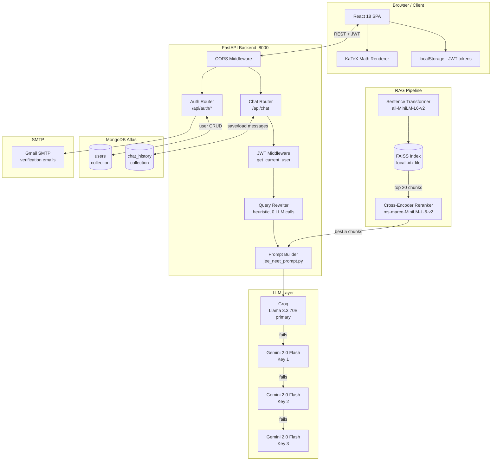
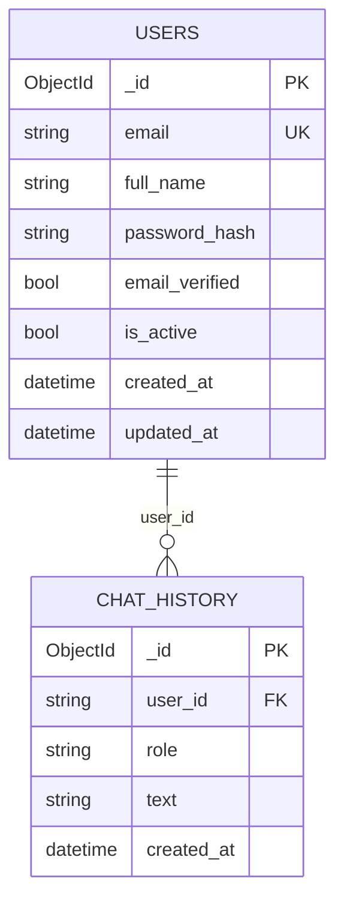
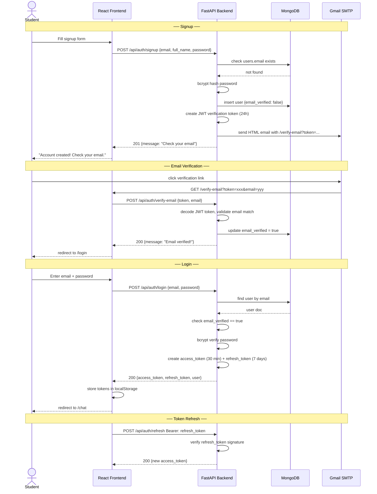
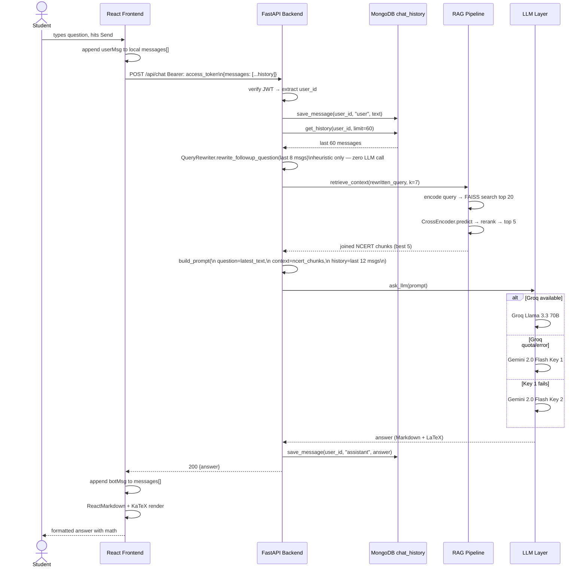
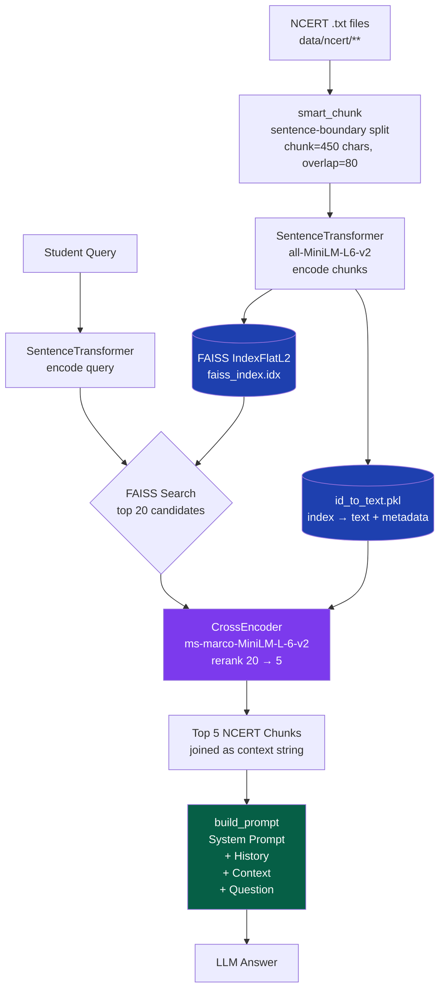
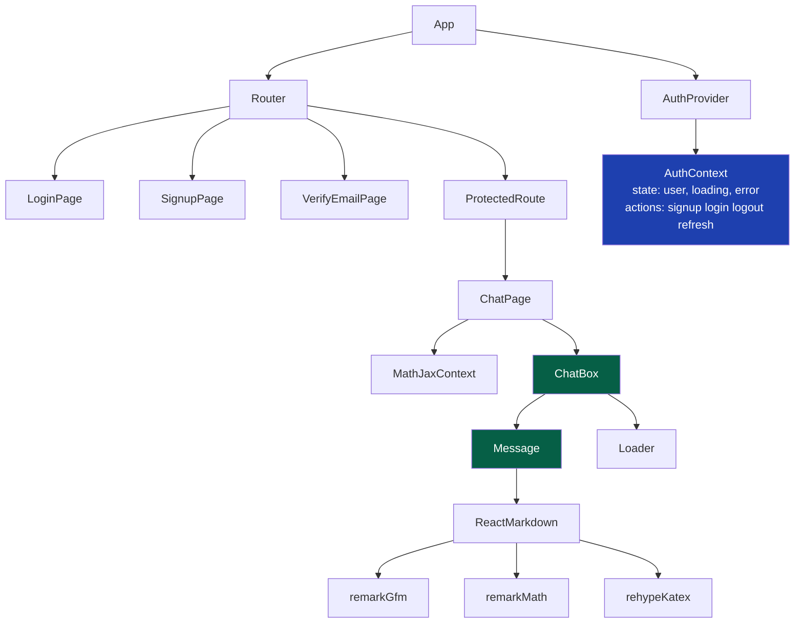

# JEE/NEET AI Tutor — RAG + Groq + Gemini

> An AI-powered tutoring platform built with **Retrieval-Augmented Generation (RAG)**, **Groq Llama 3.3 70B**, and **Google Gemini** to help students prepare for JEE and NEET with NCERT-grounded, exam-pattern answers.

---

## Table of Contents

- [Overview](#overview)
- [Features](#features)
- [Tech Stack](#tech-stack)
- [System Architecture](#system-architecture)
- [Class Diagram](#class-diagram)
- [Database Schema](#database-schema)
- [Auth Flow](#auth-flow)
- [Chat Request Flow](#chat-request-flow)
- [RAG Pipeline](#rag-pipeline)
- [Frontend Component Tree](#frontend-component-tree)
- [Local Setup](#local-setup)
- [Folder Structure](#folder-structure)
- [API Reference](#api-reference)
- [Free Tier Limits](#free-tier-limits)
- [Deployment](#deployment)

---

## Overview

**JEE-NEET-RAG** is a full-stack educational AI platform. Students ask theory or numerical questions, and the AI answers with structured, step-by-step explanations grounded in NCERT content — not hallucinated answers.

**What makes it better than generic ChatGPT:**
- Answers sourced from your actual NCERT data via two-stage RAG (FAISS + Cross-Encoder reranker)
- Expert structured format per answer: Concept → Solution → Common Mistake → Exam Tip
- Per-user persistent chat history in MongoDB — context survives page refresh and re-login
- Groq Llama 3.3 70B as primary LLM with Gemini 2.0 Flash as automatic fallback

---

## Features

- JWT authentication with email verification (signup → verify → login)
- Per-user chat history stored in MongoDB — loads on every login, persists across devices
- Two-stage RAG: FAISS retrieves top 20 candidates, Cross-Encoder reranks to best 5
- Groq Llama 3.3 70B primary (14,400 req/day free) + Gemini 2.0 Flash fallback with key rotation
- Structured JEE/NEET expert prompt with LaTeX math rendering via KaTeX
- Smart sentence-boundary chunking keeps formulas and explanations intact
- NCERT PDF extraction utility — convert PDFs to `.txt` for ingestion
- Token-efficient sliding window — last 12 messages sent to LLM, no runaway costs
- Copy button on every response

---

## Tech Stack

| Layer | Technology |
|---|---|
| **Frontend** | React 18, TailwindCSS, ReactMarkdown, KaTeX, Lucide Icons |
| **Backend** | FastAPI, Uvicorn, Python 3.10+ |
| **Primary LLM** | Groq Llama 3.3 70B (free, 14,400 req/day) |
| **Fallback LLM** | Google Gemini 2.0 Flash (free, rotates up to 3 keys) |
| **Vector DB** | FAISS (local, unlimited) |
| **Reranker** | Cross-Encoder `ms-marco-MiniLM-L-6-v2` (local, free) |
| **Embeddings** | `all-MiniLM-L6-v2` (local, free) |
| **Database** | MongoDB Atlas (free tier — users + chat history) |
| **Auth** | JWT HS256 (access 30 min + refresh 7 days) + SMTP email verification |

---

## System Architecture



---

## Class Diagram

```mermaid
classDiagram
    direction TB

    %% ── Pydantic Models ──────────────────────────────────────────
    class UserBase {
        +EmailStr email
        +str full_name
    }
    class UserSignup {
        +str password
    }
    class UserLogin {
        +EmailStr email
        +str password
    }
    class UserResponse {
        +str id
        +EmailStr email
        +str full_name
        +datetime created_at
        +bool email_verified
    }
    class TokenResponse {
        +str access_token
        +str refresh_token
        +str token_type
        +UserResponse user
    }
    class EmailVerificationRequest {
        +EmailStr email
        +str token
    }
    class AuthProvider {
        <<enumeration>>
        LOCAL
    }
    UserBase <|-- UserSignup
    UserBase <|-- UserResponse

    %% ── Database Layer ───────────────────────────────────────────
    class UserDB {
        <<static>>
        +create_user(email, full_name, password_hash, email_verified) Dict
        +get_user_by_email(email) Dict
        +get_user_by_id(user_id) Dict
        +update_user(user_id, kwargs) Dict
        +verify_email(email) Dict
        +delete_user(user_id) bool
        +user_exists(email) bool
    }
    class ChatHistoryDB {
        <<static>>
        +COLL = "chat_history"
        +save_message(user_id, role, text) bool
        +get_history(user_id, limit) list
        +clear_history(user_id) bool
    }

    %% ── Auth Utilities ───────────────────────────────────────────
    class AuthUtils {
        <<module>>
        +SECRET_KEY: str
        +ALGORITHM = "HS256"
        +ACCESS_TOKEN_EXPIRE_MINUTES = 30
        +REFRESH_TOKEN_EXPIRE_DAYS = 7
        +hash_password(password) str
        +verify_password(plain, hashed) bool
        +create_access_token(data) str
        +create_refresh_token(data) str
        +create_email_verification_token(email) str
        +verify_email_verification_token(token) str
        +get_current_user(credentials) Dict
    }

    %% ── LLM Layer ────────────────────────────────────────────────
    class GeminiLLM {
        <<module>>
        +GROQ_API_KEY: str
        +GROQ_MODEL: str
        +GEMINI_KEYS: list
        -_groq_client: Groq
        -_gemini_key_cycle: cycle
        -_ask_groq(prompt) str
        -_ask_gemini(prompt, api_key) str
        +ask_llm(prompt) str
        +generate_answer(prompt, query, context) str
    }
    class JeeNeetPrompt {
        <<module>>
        +SYSTEM_PROMPT: str
        +build_prompt(question, context, history, subject, exam) str
    }

    %% ── RAG Layer ────────────────────────────────────────────────
    class Retriever {
        <<module>>
        -_model: SentenceTransformer
        -_reranker: CrossEncoder
        -_index: faiss.Index
        -_id_map: dict
        -_load_model() SentenceTransformer
        -_load_reranker() CrossEncoder
        -_load_index() faiss.Index
        -_load_id_map() dict
        +retrieve_context(query, k) str
    }
    class Ingest {
        <<module>>
        +CHUNK_SIZE = 450
        +CHUNK_OVERLAP = 80
        +smart_chunk(text, chunk_size, overlap) list
        +infer_subject_and_chapter(file_path) tuple
    }
    class ExtractNcert {
        <<module>>
        +pdf_to_txt(pdf_path, output_path) int
        +extract_directory(pdf_dir, output_dir) void
    }
    class QueryRewriter {
        <<module>>
        +VAGUE_TRIGGERS: set
        -_is_vague(text) bool
        +rewrite_followup_question(history) str
    }

    %% ── API Routes ───────────────────────────────────────────────
    class AuthRouter {
        <<FastAPI Router>>
        +prefix = "/auth"
        +signup(user_data) Dict
        +verify_email(request) Dict
        +login(credentials) TokenResponse
        +refresh_token(current_user) TokenResponse
        +get_current_user_profile(current_user) UserResponse
        +logout(current_user) Dict
        +resend_verification_email(email) Dict
    }
    class ChatRouter {
        <<FastAPI Router>>
        +HISTORY_WINDOW = 12
        +chat(req, current_user) Dict
        +get_history(current_user) Dict
        +clear_history(current_user) Dict
    }

    %% ── Relationships ────────────────────────────────────────────
    AuthRouter --> UserDB
    AuthRouter --> AuthUtils
    AuthRouter --> UserSignup
    AuthRouter --> UserLogin
    AuthRouter --> TokenResponse
    ChatRouter --> ChatHistoryDB
    ChatRouter --> Retriever
    ChatRouter --> JeeNeetPrompt
    ChatRouter --> QueryRewriter
    ChatRouter --> GeminiLLM
    JeeNeetPrompt ..> GeminiLLM : prompt passed to
    Retriever --> Ingest : shares chunking logic
```



---

## Database Schema



**Indexes:**
- `users.email` — unique index (enforces one account per email)
- `chat_history.(user_id, created_at)` — compound index (fast history lookup sorted by time)

---

## Auth Flow



---

## Chat Request Flow



---

## RAG Pipeline



---

## Frontend Component Tree



---

## Local Setup

### 1. Clone

```bash
git clone https://github.com/bikram993298/jee-neet-rag.git
cd jee-neet-rag
```

### 2. Backend

```bash
cd backend
python -m venv .venv
source .venv/bin/activate          # Windows: .venv\Scripts\activate
pip install -r requirements.txt
```

Create `backend/.env`:

```ini
# RAG / Embeddings
FAISS_INDEX_PATH=data/embeddings/faiss_index.idx
ID_MAP_PATH=data/embeddings/id_to_text.pkl
EMBEDDING_MODEL=all-MiniLM-L6-v2

# Primary LLM — get free key at console.groq.com
GROQ_API_KEY=your_groq_key_here
GROQ_MODEL=llama-3.3-70b-versatile

# Fallback LLM — get free key at aistudio.google.com
GEMINI_API_KEY=your_gemini_key_here
GEMINI_KEY_1=your_gemini_key_here
# GEMINI_KEY_2=second_key   (optional extra quota)
# GEMINI_KEY_3=third_key
GEMINI_MODEL=gemini-2.0-flash

# MongoDB Atlas — free tier at mongodb.com/atlas
MONGODB_URL=mongodb+srv://<user>:<pass>@cluster0.xxxxx.mongodb.net/
DB_NAME=jee_neet_rag

# JWT secret — python -c "import secrets; print(secrets.token_hex(32))"
SECRET_KEY=your_32_char_secret_here

# SMTP email verification (Gmail recommended)
SMTP_SERVER=smtp.gmail.com
SMTP_PORT=587
SENDER_EMAIL=your_email@gmail.com
SENDER_PASSWORD=your_gmail_app_password

# Frontend URL (for verification link in emails)
FRONTEND_URL=http://localhost:5173

HOST=0.0.0.0
PORT=8000
```

### 3. Prepare NCERT data

Option A — you already have `.txt` files:

```
data/ncert/physics/ch1_physical_world.txt
data/ncert/chemistry/ch1_some_basic_concepts.txt
data/ncert/biology/ch1_living_world.txt
```

Option B — extract from NCERT PDFs (requires `pymupdf`):

```bash
# Single PDF
python -m backend.rag.extract_ncert path/to/physics_ch1.pdf data/ncert/physics/ch1.txt

# Entire folder
python -m backend.rag.extract_ncert path/to/ncert_pdfs/
```

### 4. Build FAISS index

```bash
python -m backend.rag.ingest
```

### 5. Start backend

```bash
python -m backend.api.main
```

API docs: http://127.0.0.1:8000/docs

### 6. Start frontend

```bash
cd frontend
npm install
npm run dev
```

Open: http://localhost:5173

---

## Folder Structure

```
jee-neet-rag/
├── backend/
│   ├── api/
│   │   ├── main.py                    FastAPI app, CORS, startup
│   │   └── routes/
│   │       ├── auth.py                signup, login, verify, refresh, logout
│   │       └── chat.py                POST /chat, GET+DELETE /chat/history
│   ├── models/
│   │   ├── gemini_llm.py              Groq primary + Gemini key-rotation fallback
│   │   ├── jee_neet_prompt.py         Expert system prompt + build_prompt()
│   │   └── user.py                    Pydantic schemas (UserSignup, TokenResponse…)
│   ├── rag/
│   │   ├── ingest.py                  Chunk + embed + build FAISS index
│   │   ├── retriever.py               FAISS + Cross-Encoder two-stage retrieval
│   │   ├── extract_ncert.py           PDF → txt utility (pymupdf)
│   │   └── merge_embeddings.py        Merge multiple FAISS indexes
│   ├── utils/
│   │   ├── auth.py                    JWT, bcrypt, Bearer token verification
│   │   ├── database.py                UserDB + ChatHistoryDB (MongoDB)
│   │   ├── email.py                   SMTP verification + password reset
│   │   └── query_rewriter.py          Heuristic follow-up resolver (no LLM cost)
│   ├── config.py                      Env var loading, path constants
│   └── requirements.txt
├── frontend/
│   └── src/
│       ├── App.jsx                    Router + AuthProvider
│       ├── components/
│       │   ├── ChatBox.jsx            Chat UI, loads history on login, clear button
│       │   ├── Message.jsx            ReactMarkdown + KaTeX + copy button
│       │   ├── Loader.jsx             Typing indicator
│       │   └── ProtectedRoute.jsx     Redirects to /login if unauthenticated
│       ├── context/
│       │   └── AuthContext.jsx        JWT storage, signup/login/logout/refresh
│       └── pages/
│           ├── LoginPage.jsx
│           ├── SignupPage.jsx
│           └── VerifyEmailPage.jsx    Auto-verifies token from URL param
├── data/
│   ├── ncert/                         Your .txt NCERT files go here
│   └── embeddings/                    Auto-generated by ingest.py
├── .env.example
└── README.md
```

---

## API Reference

### Auth endpoints

| Method | Endpoint | Auth | Description |
|---|---|---|---|
| POST | `/api/auth/signup` | — | Register, sends verification email |
| POST | `/api/auth/verify-email` | — | Verify email with JWT token from link |
| POST | `/api/auth/login` | — | Returns access + refresh tokens |
| POST | `/api/auth/refresh` | Bearer refresh | New access token |
| GET | `/api/auth/me` | Bearer access | Current user profile |
| POST | `/api/auth/logout` | Bearer access | Logout (client discards tokens) |
| POST | `/api/auth/resend-verification-email` | — | Resend verification email |

### Chat endpoints

| Method | Endpoint | Auth | Description |
|---|---|---|---|
| POST | `/api/chat` | Bearer access | Send message, get AI answer |
| GET | `/api/chat/history` | Bearer access | Load full chat history |
| DELETE | `/api/chat/history` | Bearer access | Clear all chat history |

---

## Free Tier Limits

| Service | Free Limit | Role |
|---|---|---|
| Groq Llama 3.3 70B | 14,400 req/day | Primary LLM |
| Gemini 2.0 Flash | 1,500 req/day per key | Fallback (×3 keys = 4,500/day) |
| MongoDB Atlas | 512 MB | Users + chat history |
| FAISS | Unlimited | Local vector search |
| Cross-Encoder | Unlimited | Local reranking |
| Render (backend) | 750 hrs/month | Hosting |
| Vercel (frontend) | Unlimited | Hosting |

**Total cost: ₹0**

---

## Deployment

### Backend — Render

1. Create a **Web Service** at render.com
2. Connect your GitHub repo, set root to project root
3. Add all variables from `backend/.env` as environment variables
4. Start command: `python -m backend.api.main`

### Frontend — Vercel

1. Import repo at vercel.com
2. Set `VITE_API_URL=https://your-backend.onrender.com`
3. Deploy

---

## Contributing

1. Fork the repository
2. Create a branch: `git checkout -b feature/my-feature`
3. Commit: `git commit -m "Add my feature"`
4. Push: `git push origin feature/my-feature`
5. Open a Pull Request

---

## License

MIT License © 2025
Developed with ❤️ by [Bikram Barman](https://github.com/bikram993298)
